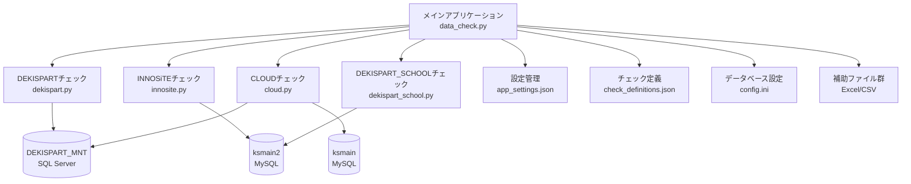

# 設計文書

## 概要

データチェックシステムは、複数のデータシリーズ（DEKISPART、INNOSITE、DEKISPART_SCHOOL、CLOUD）に対してデータ品質チェックを実行するPythonベースのデスクトップアプリケーションです。システムはTkinterを使用したGUIを提供し、データベース接続、チェック実行、結果表示、設定管理の機能を統合しています。

## アーキテクチャ

### システム構成



### レイヤー構成

1. **プレゼンテーション層**: Tkinter GUI（data_check.py）
2. **ビジネスロジック層**: 各シリーズ固有のチェックロジック
3. **データアクセス層**: データベース接続とクエリ実行
4. **設定・構成層**: JSON/INI設定ファイル管理

## コンポーネントと インターフェース

### 1. メインアプリケーション（DataCheckerApp）

**責任:**
- GUI管理とユーザーインタラクション
- チェック実行の統合と進捗管理
- 結果表示とフィルタリング
- 設定管理

**主要メソッド:**
```python
class DataCheckerApp:
    def __init__(self, master)
    def run_single_series_check(self, series_name)
    def apply_filters_and_sort(self, event=None)
    def download_results(self)
    def open_file_settings(self)
    def open_check_definition_editor(self)
```

### 2. シリーズチェックモジュール

各シリーズ（DEKISPART、INNOSITE、DEKISPART_SCHOOL、CLOUD）は共通のインターフェースを実装：

```python
def fetch_data() -> pd.DataFrame
def validate_data(df, progress_callback, *aux_data) -> pd.DataFrame
def save_to_excel(errors_df)
```

**共通エラー形式:**
```python
{
    "シリーズ": str,      # シリーズ名
    "ユーザID": str,      # 対象レコードのID
    "チェックID": str     # チェック項目識別子
}
```

### 3. データベース接続管理

**SQL Server接続（DEKISPART、CLOUD）:**
```python
conn_str = "DRIVER={ODBC Driver 17 for SQL Server};SERVER=server;DATABASE=db;UID=user;PWD=pass;TrustServerCertificate=yes"
```

**MySQL接続（INNOSITE、DEKISPART_SCHOOL）:**
```python
conn = pymysql.connect(host="host", database="db", user="user", password="pass", charset="sjis")
```

### 4. 設定管理システム

**app_settings.json構造:**
```json
{
    "aux_file_paths": {
        "series_file_type_path": "file_path",
        ...
    }
}
```

**check_definitions.json構造:**
```json
{
    "CHECK_ID": {
        "series": "シリーズ名",
        "name": "チェック項目名",
        "user_message": "カスタムメッセージ",
        "default_message": "デフォルトメッセージ",
        "severity": "エラー|警告",
        "description": "詳細説明"
    }
}
```

## データモデル

### チェック結果データモデル

```python
@dataclass
class CheckResult:
    series: str          # シリーズ名
    user_id: str        # ユーザーID
    check_id: str       # チェックID
    error_message: str  # エラーメッセージ
    severity: str       # 重要度
```

### 補助ファイルデータモデル

各シリーズで使用される補助ファイル：

- **個人名チェックファイル**: Excel形式、個人名リスト
- **トータルネット登録ファイル**: CSV形式、顧客番号リスト
- **不要販売店リストファイル**: Excel形式、対象外販売店リスト
- **担当者マスタファイル**: CSV形式、担当者情報
- **得意先マスタファイル**: CSV形式、得意先情報

## エラーハンドリング

### エラー分類

1. **データベース接続エラー**
   - 接続失敗時の再試行ロジック
   - ユーザーへの明確なエラーメッセージ表示

2. **ファイル読み込みエラー**
   - 補助ファイル不存在時の警告表示
   - エンコーディングエラーの自動検出・修正

3. **データ処理エラー**
   - 不正データ形式の検出とスキップ
   - 処理中断時の状態保持

4. **GUI操作エラー**
   - 無効な操作に対する適切なフィードバック
   - アプリケーション異常終了の防止

### エラー処理戦略

```python
try:
    # データベース操作
    result = execute_database_operation()
except DatabaseConnectionError as e:
    logger.error(f"Database connection failed: {e}")
    show_error_dialog("データベース接続に失敗しました")
    return None
except DataProcessingError as e:
    logger.warning(f"Data processing issue: {e}")
    # 処理を継続し、問題のあるレコードをスキップ
    continue
```

## テスト戦略

### 単体テスト

1. **チェックロジックテスト**
   - 各チェック関数の正常系・異常系テスト
   - エッジケースの検証

2. **データベース接続テスト**
   - モックデータベースを使用した接続テスト
   - クエリ実行結果の検証

3. **ファイル処理テスト**
   - 各種ファイル形式の読み込みテスト
   - エンコーディング対応テスト

### 統合テスト

1. **エンドツーエンドテスト**
   - 実際のデータベースを使用した全体フローテスト
   - GUI操作を含む統合テスト

2. **パフォーマンステスト**
   - 大量データでの処理時間測定
   - メモリ使用量の監視

### テストデータ

```python
# テスト用のサンプルデータ
test_data = {
    "valid_record": {
        "stdUserID": "12345678",
        "stdName": "テストユーザー",
        "stdKaiyaku": False
    },
    "invalid_record": {
        "stdUserID": "123",  # 桁数不足
        "stdName": "",       # 必須項目空白
        "stdKaiyaku": False
    }
}
```

## セキュリティ考慮事項

### データベースセキュリティ

1. **認証情報の保護**
   - 設定ファイルでの平文パスワード保存（改善要検討）
   - データベース接続の暗号化（TrustServerCertificate=yes）

2. **アクセス制御**
   - 読み取り専用アクセスの使用
   - 最小権限の原則適用

### ファイルセキュリティ

1. **補助ファイルの検証**
   - ファイル存在確認
   - ファイル形式の検証

2. **出力ファイルの保護**
   - 適切なファイル権限設定
   - 機密データの適切な取り扱い

## パフォーマンス考慮事項

### データ処理最適化

1. **バッチ処理**
   - 大量データの分割処理
   - 進捗表示による応答性向上

2. **メモリ管理**
   - DataFrameの効率的な使用
   - 不要オブジェクトの適切な解放

3. **データベースクエリ最適化**
   - 必要なカラムのみの取得
   - インデックスの活用

### GUI応答性

1. **非同期処理**
   - バックグラウンドでのチェック実行
   - UIフリーズの防止

2. **進捗表示**
   - リアルタイムな進捗更新
   - キャンセル機能の提供

## 運用・保守性

### ログ管理

```python
import logging

logging.basicConfig(
    filename='application.log',
    level=logging.INFO,
    format='%(asctime)s - %(levelname)s - %(message)s'
)
```

### 設定管理

1. **バージョン管理**
   - アプリケーションバージョンの追跡
   - 設定ファイルの互換性管理

2. **デプロイメント**
   - 実行環境の依存関係管理
   - 設定ファイルの環境別管理

### 監視・メトリクス

1. **処理時間の測定**
   - 各チェック処理の実行時間記録
   - パフォーマンス劣化の検出

2. **エラー率の監視**
   - チェック失敗率の追跡
   - 品質メトリクスの収集